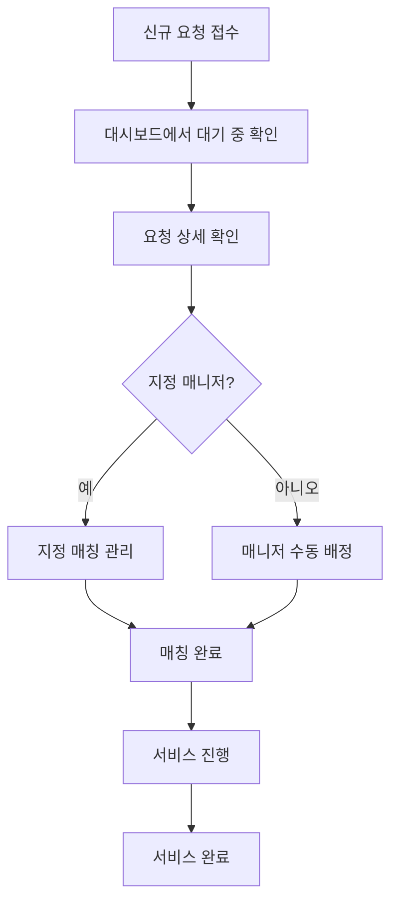

# 행복안심동행 관리자 사용설명서

버전: 1.0
최종 수정일: 2026-02-17

---

## 목차

1. [관리자 로그인](#1-관리자-로그인)
2. [대시보드](#2-대시보드)
3. [회원 관리](#3-회원-관리)
4. [매니저 관리](#4-매니저-관리)
5. [매니저 지원 관리](#5-매니저-지원-관리)
6. [서비스 요청 관리](#6-서비스-요청-관리)
7. [지정 매칭 관리](#7-지정-매칭-관리)
8. [결제 관리](#8-결제-관리)
9. [환불 관리](#9-환불-관리)
10. [수익 관리](#10-수익-관리)
11. [서비스 가격 관리](#11-서비스-가격-관리)
12. [설정](#12-설정)

---

## 1. 관리자 로그인

### 접속 방법
1. 웹 브라우저에서 관리자 페이지 접속: `https://도메인/admin/login`
2. 관리자 이메일과 비밀번호 입력
3. **로그인** 버튼 클릭

### 로그인 정보
- **인증 방식**: 쿠키 기반 세션 + bcrypt 비밀번호 해싱
- **보안**: 페이지/API 레벨에서 인증 확인
- **세션 유지**: 브라우저 종료 시까지

### 주의사항
⚠️ 관리자 계정은 모든 데이터에 접근 가능하므로 계정 정보를 안전하게 관리하세요.

---

## 2. 대시보드

관리자 페이지 메인 화면으로, 플랫폼의 핵심 통계를 한눈에 확인할 수 있습니다.

### 주요 통계 카드

| 통계 | 설명 |
|------|------|
| **전체 회원** | 플랫폼에 가입한 고객 수 |
| **전체 매니저** | 승인된 매니저 수 |
| **대기 중인 요청** | 아직 처리되지 않은 서비스 요청 수 |
| **총 매출** | 결제 완료된 전체 금액 |

### 최근 서비스 요청 테이블

최근 10개의 서비스 요청을 시간순으로 표시합니다.

**표시 정보**:
- 요청일시
- 고객명 (회원/비회원)
- 서비스 종류
- 서비스 일시
- 요청 상태
- 예상 금액

**요청 상태 종류**:
- 🟡 **대기 중**: 새로 접수된 요청
- 🔵 **확인됨**: 관리자가 확인한 요청
- 🟣 **매칭 중**: 매니저 매칭 진행 중
- 🟢 **매칭 완료**: 매니저 배정 완료
- 🔷 **진행 중**: 서비스 진행 중
- ✅ **완료**: 서비스 완료
- 🔴 **취소됨**: 고객 또는 관리자가 취소

---

## 3. 회원 관리

경로: `/admin/users`

### 기능
- 전체 회원 목록 조회
- 회원 상세 정보 확인
- 회원 검색 및 필터링

### 회원 정보 항목
- 이름
- 이메일
- 전화번호
- 가입일
- 서비스 이용 횟수

---

## 4. 매니저 관리

경로: `/admin/managers`

### 기능
- 승인된 매니저 목록 조회
- 매니저 상세 정보 확인
- 매니저 활동 내역 확인
- 매니저 승인 취소

### 매니저 정보 항목
- 이름
- 이메일
- 전화번호
- 서비스 가능 지역
- 전문 서비스 분야
- 승인 상태
- 서비스 완료 건수

### 주의사항
⚠️ 매니저 승인 취소 시 해당 매니저가 배정된 진행 중인 서비스가 있는지 먼저 확인하세요.

---

## 5. 매니저 지원 관리

경로: `/admin/manager-applications`

### 기능
- 매니저 지원 신청 목록 조회
- 지원서 상세 내용 확인
- **승인** 또는 **거부** 처리

### 승인 프로세스

1. **지원서 검토**
   - 신분증 확인
   - 계좌 정보 확인
   - 경력 및 자격 확인

2. **승인 처리**
   - 승인 버튼 클릭
   - 매니저 계정 자동 생성
   - 승인 알림 발송 (이메일/SMS)

3. **거부 처리**
   - 거부 사유 입력
   - 거부 알림 발송

### 지원 제한
⚠️ 현재 시스템: **선착순 1명 제한** (중복 지원 방지)

---

## 6. 서비스 요청 관리

경로: `/admin/requests`

### 기능
- 전체 서비스 요청 목록 조회
- 요청 상세 정보 확인
- 요청 상태 변경
- 매니저 수동 배정

### 서비스 요청 정보
- 고객 정보 (이름, 연락처, 주소)
- 서비스 종류
- 서비스 일시
- 소요 시간
- 예상 금액
- 상세 요청사항
- 배정된 매니저 (있는 경우)

### 상태 관리
관리자는 요청 상태를 수동으로 변경할 수 있습니다:

```
PENDING → CONFIRMED → MATCHING → MATCHED → IN_PROGRESS → COMPLETED
                                    ↓
                                CANCELLED
```

---

## 7. 지정 매칭 관리

경로: `/admin/designated-matching`

### 기능
고객이 특정 매니저를 지정한 요청을 관리합니다.

- 지정 매칭 요청 목록 조회
- 지정된 매니저의 일정 확인
- 매칭 승인/거부

### 처리 절차
1. 고객의 지정 매니저 확인
2. 해당 매니저의 일정 확인
3. 매니저에게 승인 요청 전달
4. 매니저 응답에 따라 매칭 확정

---

## 8. 결제 관리

경로: `/admin/payments`

### 기능
- 전체 결제 내역 조회
- 결제 상태 확인
- 결제 실패 건 관리

### 결제 정보
- 결제일시
- 고객명
- 서비스 요청 ID
- 결제 금액
- 결제 방법 (카드, 계좌이체 등)
- 결제 상태 (SUCCESS, FAILED, PENDING)

### 결제 상태
- ✅ **SUCCESS**: 결제 완료
- ❌ **FAILED**: 결제 실패
- ⏳ **PENDING**: 결제 대기 중

---

## 9. 환불 관리

경로: `/admin/refund-info`

### 기능
- 환불 요청 목록 조회
- 환불 처리
- 환불 내역 관리

### 환불 프로세스
1. 환불 요청 접수
2. 환불 사유 확인
3. 환불 금액 계산 (서비스 취소 시점에 따라 차등)
4. 토스페이먼츠 API를 통한 환불 처리
5. 환불 완료 알림

### 환불 정책
- **서비스 24시간 전 취소**: 전액 환불
- **서비스 24시간 이내 취소**: 50% 환불
- **서비스 시작 후 취소**: 환불 불가

---

## 10. 수익 관리

경로: `/admin/revenue`

### 기능
- 일별/월별 수익 통계
- 서비스별 매출 분석
- 매니저별 수익 현황

### 제공 정보
- 총 매출
- 수수료 수익
- 매니저 정산 금액
- 순이익

---

## 11. 서비스 가격 관리

경로: `/admin/service-prices`

### 기능
서비스별 가격을 설정하고 관리합니다.

### 서비스 종류
1. **병원 동행**: 진료 접수부터 약국 처방까지
2. **가사 돌봄**: 청소, 정리정돈, 식사 준비
3. **생활 동행**: 관공서, 은행, 장보기
4. **노인 돌봄**: 말벗, 산책, 건강 관리
5. **아이 돌봄**: 등하원 매니저, 긴급 돌봄
6. **기타**: 맞춤형 서비스

### 가격 설정
- 기본 요금 설정
- 시간당 추가 요금 설정
- 특별 요금 (야간, 주말, 공휴일)

### 주의사항
⚠️ 가격 변경 시 기존 요청에는 영향을 주지 않으며, 새로운 요청부터 적용됩니다.

---

## 12. 설정

경로: `/admin/settings`

### 기능
- 관리자 계정 관리
- 관리자 추가/삭제
- 시스템 설정

### 관리자 계정 관리
1. **새 관리자 추가**
   - 이메일, 비밀번호 설정
   - 권한 부여

2. **관리자 삭제**
   - 기존 관리자 제거
   - ⚠️ 본인 계정은 삭제 불가

---

## 주요 작업 흐름

### 신규 서비스 요청 처리



### 매니저 승인 프로세스

```
1. 매니저 지원 신청
   ↓
2. 관리자 검토 (신분증, 계좌 정보, 경력)
   ↓
3. 승인/거부 결정
   ↓
4. 승인 → 매니저 계정 생성 → 알림 발송
   거부 → 거부 사유 입력 → 알림 발송
```

---

## 자주 묻는 질문 (FAQ)

### Q1. 비회원 요청은 어떻게 확인하나요?
A: 서비스 요청 관리 페이지에서 고객명이 "비회원"으로 표시됩니다. 상세 페이지에서 게스트 정보(이름, 전화번호, 이메일)를 확인할 수 있습니다.

### Q2. 매니저 지원이 중복으로 들어왔어요.
A: 현재 시스템은 선착순 1명만 지원 가능하도록 제한되어 있습니다. 동일 이메일로 중복 지원은 불가능합니다.

### Q3. 환불 처리는 얼마나 걸리나요?
A: 토스페이먼츠를 통한 환불은 즉시 처리되며, 실제 입금까지는 카드사별로 3-5 영업일이 소요됩니다.

### Q4. 서비스 가격을 변경하면 언제부터 적용되나요?
A: 가격 변경은 저장 즉시 적용되며, 기존 요청에는 영향을 주지 않고 새로운 요청부터 적용됩니다.

### Q5. 관리자 계정 비밀번호를 잊어버렸어요.
A: 현재 비밀번호 재설정 기능은 없습니다. 다른 관리자에게 요청하여 계정을 재생성하거나, 데이터베이스에 직접 접근하여 변경해야 합니다.

---

## 기술 정보

### 사용 기술
- **프론트엔드**: Next.js 14 App Router
- **데이터베이스**: Supabase (PostgreSQL)
- **인증**: 쿠키 기반 세션 + bcrypt
- **결제**: 토스페이먼츠 SDK v1

### 데이터베이스 테이블
- `admins`: 관리자 계정
- `users`: 회원 정보
- `managers`: 매니저 정보
- `service_requests`: 서비스 요청
- `payments`: 결제 정보
- `applications`: 매니저 지원 정보
- `service_prices`: 서비스 가격

---

## 긴급 연락처

시스템 문제 발생 시:
- 개발팀 이메일: [개발팀 이메일]
- 긴급 연락처: [전화번호]

---

**문서 끝**

이 문서는 행복안심동행 플랫폼의 관리자용 사용설명서입니다.
시스템 업데이트 시 본 문서도 함께 업데이트됩니다.
